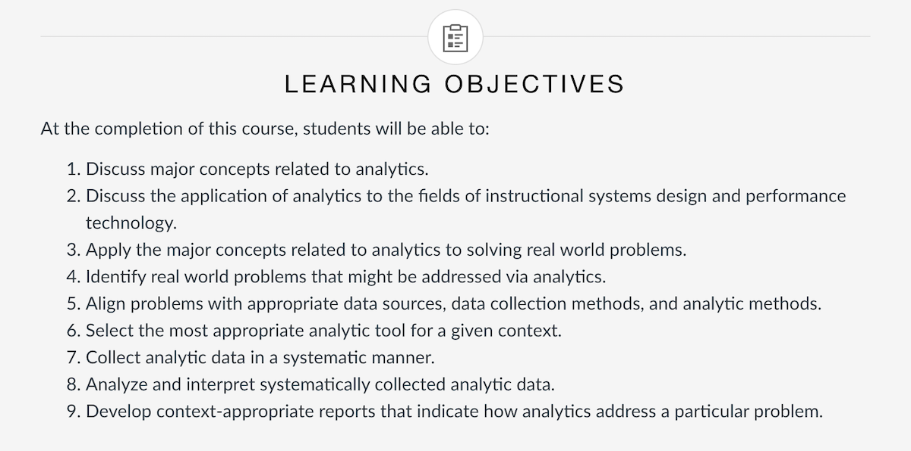
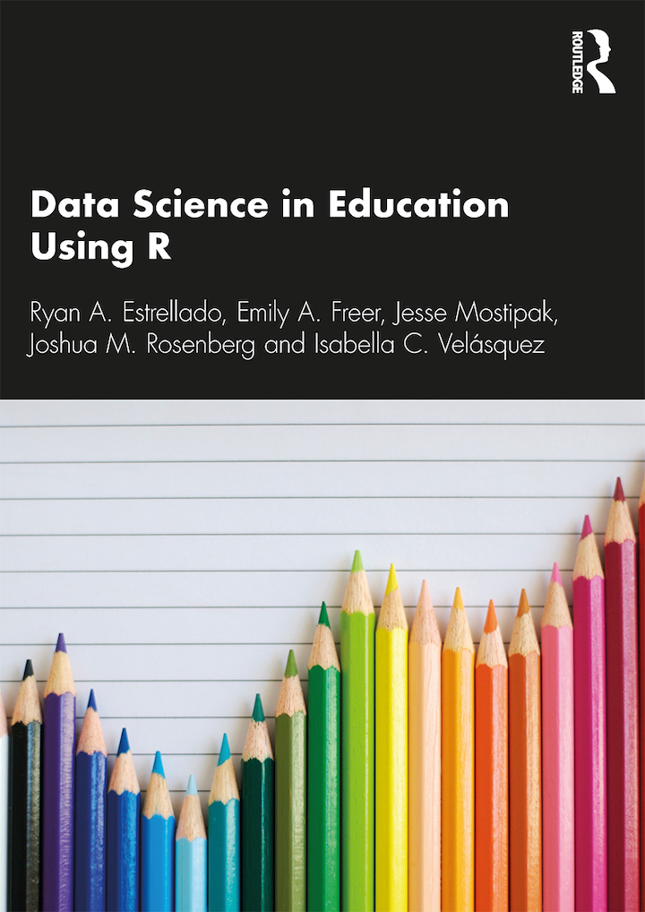
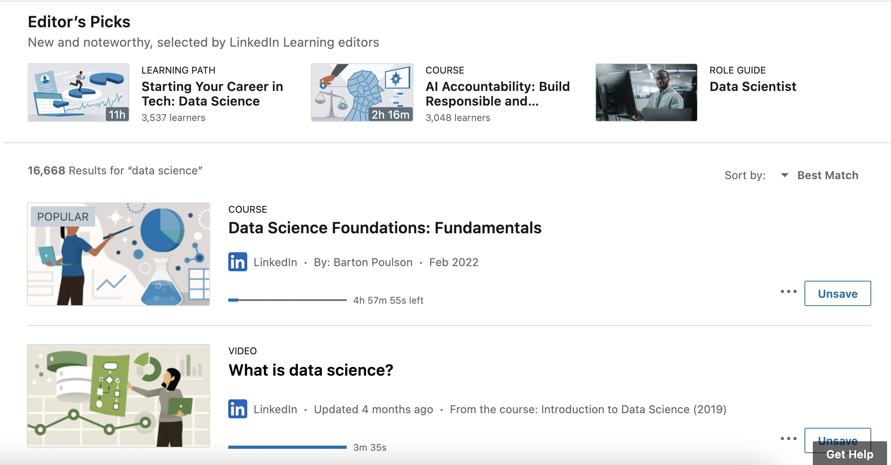

```{r setup, include=FALSE}
usethis::use_git_ignore(c("*.csv", "*.rds"))
options(htmltools.dir.version = FALSE)

library(knitr)
library(tidyverse)
library(xaringan)
library(fontawesome)
```

class: inverse, center, middle

# `r fa("far fa-images", fill = "#fff")`

**View the slides:** 

[bretsw.com/eme6356-su25-module8](https://bretsw.com/eme6356-su25-module8)

---

class: inverse, center, middle

# `r fa("fas fa-backward", fill = "#fff")` <br><br> EME6356 In Review

---

# `r fa("fas fa-backward", fill = "#fff")` EME6356 Learning Objectives

```{r, out.width = "100%", echo = FALSE, fig.align = "center"}

```

(See the [course syllabus](https://canvas.fsu.edu/courses/275488/assignments/syllabus))

---

# `r fa("fas fa-backward", fill = "#fff")` Course Objective 1

--

`r fa("fas fa-comment-dots", fill = "#782F40")` **1. Discuss major concepts related to analytics.**

<hr>

--

1.1 Identify the basic steps in the analytics process: measure, collect, analyze, and report.

--

1.2 Analyze foundational analytics concepts.

--

5.1 Apply data visualization for telling analytics stories.

---

# `r fa("fas fa-backward", fill = "#fff")` Course Objective 2

`r fa("fas fa-comment-dots", fill = "#782F40")` **2. Discuss the application of analytics to the fields of instructional systems design and performance technology.**

<hr>

--

2.1 Apply analytics to improve performance at home and at work.

--

3.1 Apply analytics to improve performance in educational settings (K12 to higher ed; formal to informal).

--

4.1 Apply analytics to evaluate online activity.

--

6.1 Assess ethical considerations and challenges for using analytics.

--

7.1 Identify trends and future directions of analytics.

--

8.1 Critique presentations of how analytics have been or may be applied to solving a real-world problem.

---

# `r fa("fas fa-backward", fill = "#fff")` Course Objectives 3, 4, 5, 6

`r fa("fas fa-thumbtack", fill = "#782F40")` **3. Apply the major concepts related to analytics to solving real world problems.**

--

`r fa("fas fa-thumbtack", fill = "#782F40")` **4. Identify real world problems that might be addressed via analytics.**

--

`r fa("fas fa-thumbtack", fill = "#782F40")` **5. Align problems with appropriate data sources, data collection methods, and analytic methods.**

--

`r fa("fas fa-thumbtack", fill = "#782F40")` **6. Select the most appropriate analytic tool for a given context.**

<hr>

--

3.2 Develop an analytics plan that identifies and describes a real-world problem and explains how analytics might be used to address the problem through data collection, data analysis, and reporting phases.

--

5.2 Develop an analytics report that identifies a data source, accesses/collects the data, analyzes it, generates data visualizations, and tells its story.

--

7.2 Evaluate a situation in which analytics have been or may be applied to solving a real-world problem and create a compelling presentation of your evaluation.

--

8.2 Develop an ethics report that identifies and describes ethical considerations related to using analytics to solve a real-world problem and explains specific ethical concerns of data collection, data analysis, and reporting phases.

---

# `r fa("fas fa-backward", fill = "#fff")` Course Objectives 7, 8

`r fa("fas fa-pen", fill = "#782F40")` **7. Collect analytic data in a systematic manner.**

--

`r fa("fas fa-pen", fill = "#782F40")` **8. Analyze and interpret systematically collected analytic data.**

<hr>

--

3.2 Develop an analytics plan that identifies and describes a real-world problem and explains how analytics might be used to address the problem through data collection, data analysis, and reporting phases.

--

5.2 Develop an analytics report that identifies a data source, accesses/collects the data, analyzes it, generates data visualizations, and tells its story.

--

7.2 Evaluate a situation in which analytics have been or may be applied to solving a real-world problem and create a compelling presentation of your evaluation.

---

# `r fa("fas fa-backward", fill = "#fff")` Course Objective 9

`r fa("fas fa-pen", fill = "#782F40")` **9. Develop context-appropriate reports that indicate how analytics address a particular problem.**

<hr>

--

3.2 Develop an analytics plan that identifies and describes a real-world problem and explains how analytics might be used to address the problem through data collection, data analysis, and reporting phases.

5.2 Develop an analytics report that identifies a data source, accesses/collects the data, analyzes it, generates data visualizations, and tells its story.

--

8.2 Develop an ethics report that identifies and describes ethical considerations related to using analytics to solve a real-world problem and explains specific ethical concerns of data collection, data analysis, and reporting phases.

---

class: inverse, center, middle

# `r fa("fas fa-road", fill = "#fff")` <br><br> Looking Back, Looking Ahead

---

# `r fa("fas fa-road", fill = "#fff")` Sink Full of Dishes

```{r, out.width = "100%", echo = FALSE, fig.align = "center"}
include_graphics("img/sink.jpg")
```

---

class: inverse, center, middle

# `r fa("fas fa-screwdriver-wrench", fill = "#fff")` <br><br> Resources <br> for Further Exploration

---

class: inverse, center, top

# `r fa("fas fa-screwdriver-wrench", fill = "#fff")` Data Analytics Tools

<div class="padlet-embed" style="border:1px solid rgba(0,0,0,0.1);border-radius:2px;box-sizing:border-box;overflow:hidden;position:relative;width:100%;background:#F4F4F4"><p style="padding:0;margin:0"><iframe src="https://fsu.padlet.org/embed/xxl6opndte57rmc5" frameborder="0" allow="camera;microphone;geolocation" style="width:100%;height:480px;display:block;padding:0;margin:0"></iframe></p><div style="padding:8px;text-align:right;margin:0;"><a href="https://padlet.com?ref=embed" style="padding:0;margin:0;border:none;display:block;line-height:1;height:16px" target="_blank"></a></div></div>

---

class: inverse, center, middle

# `r fa("fas fa-arrows-turn-to-dots", fill = "#fff")` Self-Directed Learning

```{r, out.width = "420px", echo = FALSE, fig.align = "center"}

```

---

class: inverse, center, middle

# `r fa("fas fa-arrows-turn-to-dots", fill = "#fff")` Learn to Code

```{r, out.width = "320px", echo = FALSE, fig.align = "center"}

```

**https://datascienceineducation.com/**

---

class: inverse, center, middle

# `r fa("fas fa-arrows-turn-to-dots", fill = "#fff")` Linkedin Learning

```{r, out.width = "100%", echo = FALSE, fig.align = "center"}

```

Search **"data Science"** on Linkedin Learning: **https://www.linkedin.com/learning/**

---

class: inverse, center, middle

# `r fa("fas fa-otter", fill = "#fff")` <br><br> Play in the <br> [Analytics Sandbox](https://bretsw.com/sandbox)

---

class: inverse, center, middle

# `r fa("fab fa-github", fill = "#fff")` <br><br> Explore the [GitHub repository for code and data](https://github.com/bretsw/sandbox)

---

class: inverse, center, middle

# `r fa("fas fa-cubes-stacked", fill = "#fff")` <br><br> Use various [Datasets for practice](https://bretsw.com/post/datasets/)

---

class: inverse, center, middle

# `r fa("fas fa-calendar-day", fill = "#fff")` <br><br> Last Things

---

# `r fa("fas fa-calendar-day", fill = "#fff")` Major Assignments

```{r, out.width = "600px", echo = FALSE, fig.align = "center"}
include_graphics("img/build.jpg")
```

### Analytics Assignments (Group Projects)

- Analytics Ethics Statement (100 points) - **due Friday, August 2**

---

# `r fa("fas fa-calendar-day", fill = "#fff")` Course Evaluations

```{r, out.width = "720px", echo = FALSE, fig.align = "center"}

```

---

class: inverse, center, middle

# `r fa("fas fa-question", fill = "#fff")` <br><br> Questions

<hr>

**What questions can I answer for you now?**

**How can I support you this week?**

<hr>

`r fa("envelope", fill = "#fff")` [bret.staudtwillet@fsu.edu](mailto:bret.staudtwillet@fsu.edu) | `r fa("globe", fill = "#fff")` [bretsw.com](https://bretsw.com) | `r fa("fab fa-github", fill = "#fff")` [GitHub](https://github.com/bretsw/)
